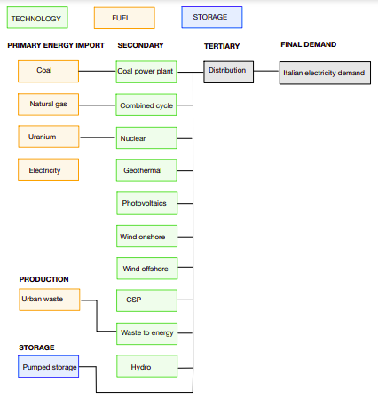

# Save the penguins - Can we be independent?

This is the code used for modelling, analysing and plotting the figures for the final project of Economics of Climate Change and Modelling Scenarios (Politecnico di Milano, 2021-2022).

## Goal

Through the open source IAM OSeMOSYS, we aim to study different scenarios to see if Italy can become energy independent.
In particular, we consider 3 year targets: 5, 10, and 15 years. Since the model starts now (2022), this corresponds to the final years 2027, 2032, and 2037.

To following technologies are taken into account:
* Photovoltaic (PHO)
* Geothermal (GEO)
* Wind of shore (WOF)
* Wind on shore (WON)
* Concentrated solar power (CSP)
* Hydroelectric power plants (HYE)
* Waste to energy (WTE)
* Combined gas cycle (CGC)
* Pumped storage (PPS)
* Coal power plants (CPP)
* Nuclear power plants (NUC)

the following fuels:
* Electricity (ELC)
* Natural gas (NAT)
* Coal (COA)
* Uranium (URN)
* Urban waste (UBW)

and the following imports and own productions:
* Electricity imports (IMPELC)
* Natural gas imports (IMPNAT)
* Coal imports (IMPCOA)
* Uranium imports (IMPURA)
* Urban waste own production (OWNUBW)

The code is based to the following energy diagram

## Usage

Open `osemosys.gms` and specify the model scenario.

To plot, save some data as *name_scenario_target.csv*. For e.g. *annualActivityByTechnology_base_5.csv*. Run the first block of `plot_all_years.R` and the plotting block you are interested in. 

For any questions, please ask klaudia.krb[at]gmail.com.
